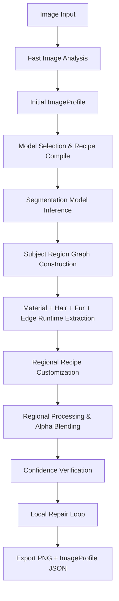

# GhostCut Architecture Bible (v2)

This document defines the architecture, runtime pipelines, schemas, and contracts governing the GhostCut Image Intelligence Engine v2.

---

## 1. Overall System Architecture & Runtime Graph

The GhostCut system transitions from a linear single-label background removal process to a non-linear, multi-attribute, regional pipeline. 



---

## 2. ImageProfile Schema Definition

Every image analyzed by GhostCut produces an `ImageProfile`. The JSON schema representation is:

```json
{
  "scene": "Studio Portrait | Outdoor Portrait | Product | Pet | Vehicle | Food | Document | Unknown",
  "subject": ["Human", "Animal", "Product", "Plant", "Mixed"],
  "background": {
    "complexity": "low | medium | high",
    "dominant_colors": ["#hex"],
    "blur": 0.0,
    "contrast": 0.0
  },
  "materials": {
    "Skin": 0.0,
    "Hair": 0.0,
    "Fur": 0.0,
    "Fabric": 0.0,
    "Glass": 0.0,
    "Plastic": 0.0,
    "Metal": 0.0,
    "Leather": 0.0,
    "Lace": 0.0,
    "Feather": 0.0
  },
  "hair_fur": {
    "has_hair": false,
    "has_fur": false,
    "hair_type": "straight | wavy | loose_curl | tight_curl | afro | frizzy | wet | flyaway | backlit | general",
    "fur_type": "none | short | long | fine | dense | whiskers"
  },
  "edge_types": ["Hard", "Soft", "Hair", "Fur", "Fabric", "Transparent", "Reflection", "Motion Blur", "Shadow"],
  "lighting": {
    "backlit": false,
    "ambient_brightness": 0.0,
    "specular_highlights": false
  },
  "confidence": {
    "initial_segmentation": 0.0,
    "overall": 0.0
  }
}
```

---

## 3. Subject Region Graph Specification

The `SubjectRegionGraph` defines the spatial segmentation of a subject mask into region nodes.
- **Nodes**: Named segments (`hair`, `skin`, `fabric`, `glass`, `metal`, `general`).
- **Edges**: Physical boundaries/transitions between adjacent nodes.
- **Attributes**: Pixel count, local mean color, dynamic range, and local matting policy.

---

## 4. ProcessingRecipe Schema

A `ProcessingRecipe` dictates the execution parameters of the pipeline:
- `model_name`: ONNX segmentation model key.
- `processing_mode`: `fast | quality | ultra`.
- `apply_matting`: boolean.
- `erode_size`: int.
- `preserve_transparency`: boolean.
- `sharpness`: int.
- `focus_thresh`: float.
- `decontaminate`: boolean.
- `quality_loop`: boolean.
- `radius_base`: float.
- `use_gpu`: boolean.

---

## 5. Memory & Hardware Abstraction

1. **CPU-First Thread Boundaries**: Restrict thread usage to `os.cpu_count()` thread bindings.
2. **Memory Arena Controls**: Disable ONNX Runtime memory arena allocation dynamically to prevent RAM fragmentation.
3. **Upscale Capping**: High-resolution steps upscale crops or detail masks using linear/guided filter layers rather than full resolution forward passes.
