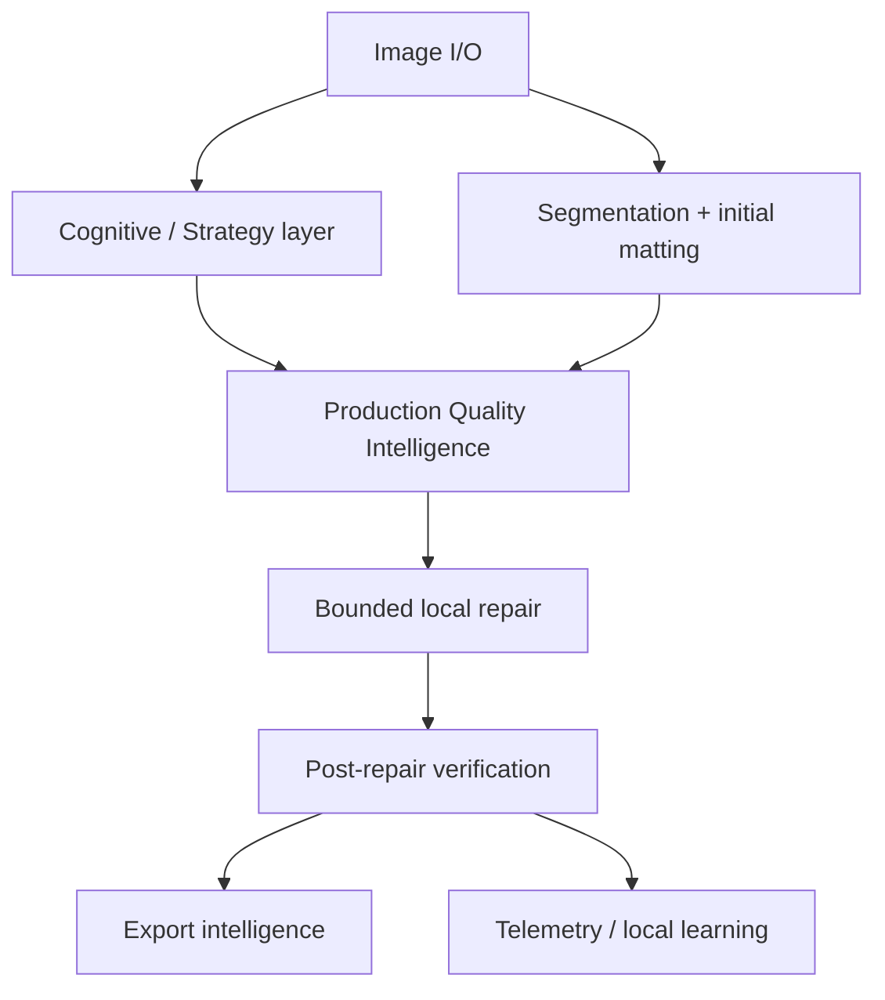
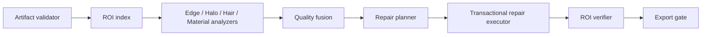

# 01 — System Architecture

## Mission

GhostCut v8.5 Production Quality Intelligence converts an already-segmented, strategy-informed alpha matte into a reliable export artifact. It is a bounded quality layer, not a replacement for segmentation, cognitive reasoning, or a general image editor. Its central promise is: repair only demonstrated defects, only in the affected region, and only when verification proves that the repair helped.

## System context



The quality layer accepts immutable source RGB, initial alpha, a validated strategy, regional policies, and resource limits. It produces a `FinalMattePackage`: final alpha/RGBA artifact, quality report, repair provenance, explainability summary, and telemetry.

## Architectural responsibilities

| Layer | Owns | Must not do |
|---|---|---|
| Cognitive / strategy | validated beliefs and permitted policies | mutate pixels |
| Quality analyzers | detect, localize, and score potential defects | repair or invent semantic evidence |
| Repair planner | rank safe repair proposals | apply unverified global changes |
| Repair executor | transactional ROI-local operators | alter source RGB / bypass limits |
| Verifier | accept or rollback based on measurements | silently retry indefinitely |
| Export gate | package validated output and warnings | hide unresolved issues |

## Core invariants

1. Source RGB is immutable for a job.
2. Alpha is float32 in `[0,1]`; all color-space conversions are explicit.
3. Every pixel mutation has a `RepairRecord` with before/after metrics and rollback provenance.
4. One repair chain per ROI; one validation retry maximum unless the user explicitly requests manual refinement.
5. Quality analyzers may disagree. Uncertainty is preserved, not averaged into a false certainty.
6. Low-resource mode may defer optional analysis, but may not report deferred pixels as verified.

## Major components



### Artifact validator

Validates shape, ranges, color declarations, policy versions, and presence of required upstream artifacts before any analysis. A failed validation is a hard stop with an actionable diagnostic.

### ROI index

Builds connected boundary regions using signed alpha distance, region graph membership, and protected masks. It is the single coordinate authority for analyzers and repairs.

### Quality fusion

Combines findings without erasing source evidence. It calculates a quality report, protects high-confidence hard-edge regions, and forwards only actionable proposals to the planner.

## Resource model

Jobs have global wall-time, memory, and ROI-pixel budgets. The scheduler assigns cheap global scans first, then full-resolution ROI work only where needed. Required verification has higher priority than optional enhancement. Cache only derived image representations for the job lifetime.

## Operational states

```text
VALIDATE → ANALYZE → PLAN → REPAIR → VERIFY → EXPORT
                         ↑          │
                         └─ one ROI-local retry ┘
```

Any cancellation or budget expiry exports the last validated artifact with a `partial_quality_verification` warning. It never commits a partially computed repair.

## Completion criteria

The architecture is considered implemented when all components obey the runtime contract, all mutations are reversible and logged, benchmark gates protect against quality regressions, and default UI presents outcomes rather than engineering traces.
