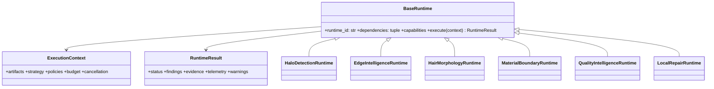

# 02 — Runtime Architecture

## Runtime model

v8.5 uses a scheduler-managed plugin-style runtime model. Each runtime has a stable identifier, declared dependencies, capability metadata, cost estimate, and a single public entry point: `execute(context) -> RuntimeResult`. Legacy `analyze()` methods must be adapted behind this contract; callers must never depend on a concrete runtime class.



## Standard lifecycle

1. Registry validates ID uniqueness, API/schema compatibility, dependencies, and declared permissions.
2. Scheduler builds a deterministic topological plan, pruning only optional modules that are unsupported by strategy or budget.
3. Runtime validates its own required artifacts, checks cancellation, emits a result, and releases temporary ROI memory.
4. Context stores output under namespaced keys; results are immutable once published.
5. Fusion/planning happens only after its declared dependencies are `OK` or explicitly `SKIPPED` with compatible fallback.

## Required runtime metadata

```python
@dataclass(frozen=True)
class RuntimeDescriptor:
    runtime_id: str
    api_version: str
    dependencies: tuple[str, ...]
    required_artifacts: tuple[str, ...]
    produces: tuple[str, ...]
    estimated_cost: CostEstimate
    capabilities: frozenset[str]
    failure_mode: Literal['block', 'degrade', 'skip']
```

## Result semantics

`OK` means usable output was produced. `SKIPPED` means a documented condition made execution unnecessary or impossible safely. `FAILED` means a required contract or computation failed. No runtime may return `OK` with malformed maps, absent calibration, or suppressed errors.

## Dependency graph

`edge`, `hair_morphology`, `material_boundary`, and `halo` execute after initial alpha and may run concurrently. `quality_intelligence` depends on their results. `local_repair` depends on an approved plan. `post_repair_verify` re-runs only affected analyzers plus quality fusion.

## Isolation and thread safety

Runtimes receive job-scoped context, never global mutable image state. They may use shared read-only model/cache handles guarded by a resource manager. A runtime cannot update registry state, policy files, or learning data directly; it emits telemetry and a separate coordinator persists approved records.

## Failure and degradation policy

- Missing required alpha/source artifacts: block job.
- Optional analyzer unavailable: skip, reduce quality confidence, log reason.
- ROI computation fails: keep pre-repair artifact and mark that ROI unverified.
- Dependency cycle or duplicate runtime ID: fail application startup/registry validation.
- Cancellation: return no mutation and emit partial telemetry.

## Runtime acceptance tests

Every runtime requires contract, shape/range, cancellation, telemetry, deterministic-output, and failure-mode tests. Registry integration tests must prove that replacing an implementation with a wrapper preserves `execute()` behavior.
