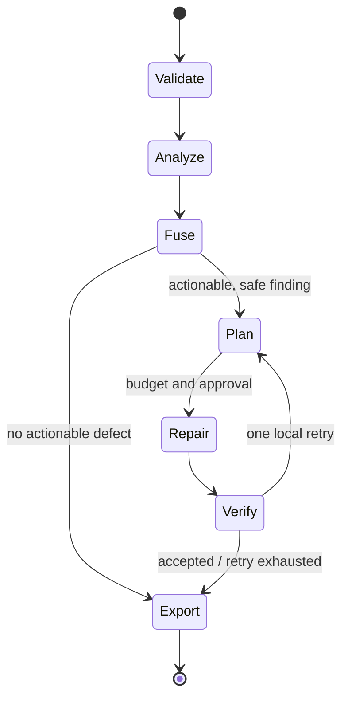

# 06 — Execution Pipeline

## Deterministic job flow

1. Validate artifacts/policy versions; construct signed-distance boundary ROIs and protected masks.
2. Schedule edge, halo, hair, and material analyzers in parallel where dependencies permit.
3. Fuse evidence into `QualityReport`; preserve conflicts and deferred work.
4. Rank proposals by expected defect reduction, risk, pixel delta, and cost.
5. Transactionally apply one bounded repair chain per ROI.
6. Re-run only affected analyzers; accept measured improvement or rollback.
7. Export the last verified artifact with report and user-appropriate summary.

## Low-resource execution

Run a cheap reduced-resolution scan to nominate ROIs, then full-resolution work only in padded candidates. Required verification outranks optional enhancement. On timeout/cancellation, retain prior validated alpha and explicitly mark pending regions; never commit partial data.

## Pipeline invariants

No global reprocessing for a local defect; no infinite loops; source RGB immutable; every action traceable by artifact and repair IDs; scheduler records skip/defer rationale.
