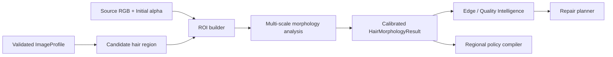

# 10 — Hair Morphology Runtime

## 1. Purpose and scope

The Hair Morphology Runtime characterizes **already validated candidate hair regions** so the Production Quality Intelligence layer can select safe, local alpha policies. It is not a person detector, a hairstyle classifier, a demographic classifier, or a generator of missing hair. Its job is narrower and testable:

> Given a candidate hair boundary and an initial alpha matte, determine what edge behaviour is present, how reliable that determination is, and which conservative refinement policy best preserves the observed structure.

The runtime helps GhostCut distinguish a dense coily/curly boundary from a sparse flyaway boundary, or an opaque wet-hair contour from low-alpha backlit strands. Those cases need different treatment. A broad “high detail” score is insufficient because it can cause inappropriate alpha expansion and background halos.

### In scope

- Hair-boundary ROI generation and confidence gating.
- Multi-attribute morphology measurement.
- Strand/cluster evidence extraction from source RGB and alpha.
- Policy recommendations for trimap width, alpha preservation, sharpening, decontamination, and repair priority.
- Calibrated uncertainty and explainability.

### Explicitly out of scope

- Identifying gender, ethnicity, age, beauty attributes, named hairstyles, or an individual's identity.
- Fabricating hair strands not supported by source pixels.
- Replacing BiRefNet or a dedicated matting model.
- Performing global semantic scene classification.

## 2. Position in the v8.5 pipeline

The runtime executes only after the cognitive layer has produced a validated `ImageProfile`, the segmentation/matting stage has emitted an `initial_alpha`, and the region graph has nominated hair candidate regions. It may run in parallel with `EdgeIntelligenceRuntime` and `MaterialBoundaryRuntime`.



It produces evidence and policy recommendations only. Pixel changes remain the responsibility of `LocalRepairRuntime` and must pass the repair acceptance gate.

## 3. Design principles

1. **Region-scoped before image-scoped.** Whole-image texture is not sufficient evidence of hair.
2. **Attributes, not one label.** Curl, density, strand width, transparency, and flyaway likelihood are independent dimensions.
3. **Measured evidence overrides a strong prior.** A portrait prior can nominate a region, but cannot justify alpha expansion absent local edge evidence.
4. **Unknown is valid.** Uncertain regions receive a conservative policy rather than a forced hair subtype.
5. **Preserve, do not invent.** Any increase in low alpha requires aligned source-image evidence and constrained edge direction.
6. **Use calibrated confidence.** Raw score is not confidence; calibration must be tied to held-out benchmark results and policy version.

## 4. Inputs

| Input | Type / range | Required | Notes |
|---|---|---:|---|
| `source_rgb` | H×W×3, declared color space | Yes | Original image; immutable. Prefer linear RGB for color operations, Lab for perceptual distances. |
| `initial_alpha` | H×W float32 `[0,1]` | Yes | Matte to characterize, not overwrite. |
| `hair_candidate_mask` | H×W bool / probability | Yes | From validated region graph and cognitive beliefs. |
| `edge_type_map` | H×W categorical/probability | Recommended | Used to distinguish strand candidates from hard boundaries. |
| `material_policy_map` | H×W policy data | Recommended | Provides skin/fabric/transparency protection. |
| `ImageProfile` | validated object | Yes | Includes semantic confidence and image scale metadata. |
| `HardwareProfile` | budget information | Yes | Controls pyramid levels, ROI cap, and CPU fallback. |

### Preconditions

- All image-space tensors have identical pixel coordinates and dimensions.
- `initial_alpha` contains finite values only and is clamped to `[0,1]` before analysis.
- Candidate hair confidence meets a configurable nomination threshold. Below it, the runtime returns `SKIPPED` or `unknown`, not a weak positive classification.
- Protected regions (for example, high-confidence facial skin) are available when upstream face/region information exists.

## 5. ROI construction

The runtime analyzes a padded boundary band rather than the entire image. This improves speed and reduces false hair evidence from background textures.

1. Create `boundary_band = abs(signed_distance(initial_alpha >= 0.5)) <= r_base`.
2. Intersect it with `hair_candidate_mask` dilated by a small, scale-aware safety margin.
3. Split disconnected components; merge only components separated by less than a policy-defined gap and supported by common region identity.
4. Expand each component by `pad_px = clamp(round(0.006 * image_diagonal), 8, 48)` without crossing the image boundary.
5. Exclude or downweight protected skin pixels and regions classified as background-only.
6. Limit the number of ROIs and total pixels for low-resource mode; report deferred ROIs explicitly.

`r_base` must be scaled by image resolution but capped. It is a search radius, not permission to expand alpha by that amount.

## 6. Morphology model

The result is a vector of independently meaningful attributes. No single value should be treated as a “hair quality” score.

```python
@dataclass(frozen=True)
class HairMorphologyResult:
    roi: Rect
    candidate_confidence: float
    density: float                  # proportion of supported fine edge structure
    curl_score: float               # directional variation, not hairstyle name
    strand_width_px: float | None
    orientation_coherence: float    # local alignment of structures
    cluster_edge_score: float       # dense boundary mass vs isolated strands
    flyaway_score: float            # supported isolated strand candidates
    transparency_score: float       # credible low-alpha strand behaviour
    wetness_specular_score: float   # specular/continuous contour cue
    backlight_score: float
    evidence_confidence: float
    policy_recommendation: HairPolicyRecommendation
    evidence: list[Evidence]
```

All scores are `[0,1]` after calibration. `strand_width_px` may be `None` when the source resolution cannot support a reliable measurement.

### 6.1 Feature extraction

For each ROI, evaluate a Gaussian pyramid at full resolution and selected lower scales. Compute:

- **Alpha transition features:** local gradient magnitude, transition width from 0.1→0.9 alpha, signed-distance stability, and contour curvature.
- **Image/alpha alignment:** normalized dot product between local luminance gradient and alpha gradient. True visible boundaries generally show stable alignment; background noise often does not.
- **Orientation features:** structure tensor eigenvalues/orientations and filter-bank responses across multiple angles. High orientation coherence suggests aligned strands; high local directional variance supports curls or textured clusters.
- **Frequency features:** scale-normalized local energy in the fine frequency range, measured only where alpha supports an edge. Fine frequency by itself is not hair evidence.
- **Topology features:** connected components in low-alpha/hair-edge candidates, skeleton lengths, endpoint count, junction count, and continuity across the alpha contour.
- **Color/transparency features:** local foreground/background color separation, alpha-color consistency, and Lab chroma residuals. These distinguish actual semi-transparent strands from coloured halo.
- **Lighting features:** a backlight cue based on bright rim structure immediately outside the boundary, and a wet/specular cue from elongated highlights that remain inside a continuous opaque contour.

### 6.2 Attribute derivation

**Density** is derived from the fraction and persistence of source-supported fine structures within the boundary band. It must not rise merely because the background is cluttered.

**Curl score** combines orientation variation along connected, aligned structures with contour curvature. It measures local directional variability, not a cosmetic curl category.

**Strand width** is estimated from ridge/valley cross-sections only when the sampling scale supports at least several pixels across the feature. At insufficient resolution, return `None` and lower confidence.

**Cluster-edge score** rises when a connected dense mass contains irregular edge detail. It should differ from `flyaway_score`, which requires isolated structures with source/alpha alignment and continuity.

**Transparency score** requires low-to-mid alpha, evidence of a foreground/background mixture, and continuity with a supported hair structure. Low alpha alone is not transparency; it may indicate a bad matte.

**Wetness/specular score** is a policy clue, not a material declaration. High score biases toward narrower, more continuous edge treatment because wet hair often forms coherent glossy clumps.

## 7. Confidence calibration and ambiguity

Raw features are fused into an uncalibrated score, then calibrated using scenario-specific held-out benchmark data. Calibration artifacts must be versioned with the model/policy.

Confidence is reduced for:

- candidate region confidence below threshold;
- insufficient ROI size or boundary samples;
- severe JPEG blocking, motion blur, or saturation clipping;
- disagreement with Edge/Material runtime evidence;
- incompatible signals, such as high transparency with no foreground/background color separation;
- analysis performed at a resolution too low to estimate strand width.

The runtime must emit an `unknown` morphology state when `evidence_confidence < policy.min_confidence`. In this state it recommends safe defaults: narrow transition band, no alpha expansion, minimal decontamination, and quality monitoring rather than aggressive repair.

## 8. Policy compiler

The runtime does not directly modify alpha. It produces a local recommendation subject to fusion by the regional policy compiler.

```python
@dataclass(frozen=True)
class HairPolicyRecommendation:
    alpha_mode: Literal['cluster_preserve', 'strand_preserve', 'continuous', 'conservative']
    trimap_half_width_px: tuple[float, float]
    guided_radius_px: tuple[float, float]
    alpha_expansion_limit_px: float
    alpha_contraction_limit_px: float
    decontamination_strength: tuple[float, float]
    sharpening_strength: tuple[float, float]
    repair_priority: float
    protected_mask_weight: float
    rationale: list[str]
```

### Decision table

| Evidence pattern | Recommended mode | Important constraints |
|---|---|---|
| Dense/clustered edge, low flyaway | `cluster_preserve` | very small expansion limit; preserve contour variation; prioritize halo checks |
| Isolated, aligned low-alpha structures | `strand_preserve` | allow low alpha; no global threshold clamp; require background-separation evidence |
| Wet/specular, continuous edge | `continuous` | narrow trimap; medium hardening; conservative color correction |
| Ambiguous/low confidence | `conservative` | no expansion; low sharpening; verification finding only |

The fusion layer may reduce aggressiveness but cannot increase an expansion limit beyond the policy's absolute ceiling without independent edge/quality evidence.

## 9. Explainability requirements

Every output must be explainable at two levels.

### Professional UI summary

```text
Fine hair detail detected near the outer boundary.
Mode: preserve visible strands
Safety: limited edge expansion; halo check enabled
Confidence: medium (background texture reduced certainty)
```

### Developer record

```json
{
  "runtime":"hair_morphology",
  "roi":[120,48,210,325],
  "attributes":{"density":0.79,"cluster_edge_score":0.82,"flyaway_score":0.18},
  "calibration":"hair-morphology-cal-v2.1",
  "recommendation":"cluster_preserve",
  "reasons":["persistent fine edge response","alpha/image gradients aligned"],
  "limits":{"alpha_expansion_limit_px":0.6}
}
```

No UI text should claim the tool “recovered” or “created” a strand unless a source-supported pixel structure was retained and verified.

## 10. Performance plan

| Mode | Work | Target behavior |
|---|---|---|
| Low-resource CPU | downsampled nomination + full-res ROIs only | bounded ROI count; defer optional lower-confidence ROIs |
| Standard | full-res ROIs + 2–3 pyramid scales | default desktop quality |
| High quality | full-res ROI analysis + extra scale/continuity check | only for validated hair candidates |

Cache grayscale, Lab conversion, image pyramids, signed distance, and source gradients per job. Do not retain raw pixels across jobs. Telemetry must record ROI pixels, scales used, elapsed time, deferred work, and cache hits.

## 11. Failure handling

| Condition | Response |
|---|---|
| No valid hair candidate | `SKIPPED`; emit reason; no policy change |
| Candidate overlaps protected face skin | downweight / carve mask; request edge policy fusion |
| Severe background texture masquerades as strands | reduce confidence; prefer `conservative` mode |
| Insufficient resolution | omit strand width; no alpha-expansion recommendation |
| Analyzer timeout/cancellation | return partial analysis, no mutation, log deferred ROI |
| Contradiction with semantic validation | preserve evidence, lower confidence, defer to consensus |

## 12. Reference implementation skeleton

```python
class HairMorphologyRuntime(BaseRuntime):
    runtime_id = "hair_morphology"
    dependencies = ("region_graph", "edge_intelligence")

    def execute(self, context: ExecutionContext) -> RuntimeResult:
        inputs = validate_hair_inputs(context)
        rois = build_candidate_rois(inputs, context.budget)
        findings, evidence = [], []
        for roi in rois:
            features = extract_multiscale_features(inputs, roi)
            raw = derive_attributes(features)
            result = calibrate_and_compile_policy(raw, context.policy)
            evidence.extend(result.evidence)
            findings.append(to_morphology_finding(result))
        return RuntimeResult.ok(findings=findings, evidence=evidence,
                                telemetry=context.telemetry.finish())
```

The actual implementation must keep feature extraction pure, policy compilation deterministic, and calibration data external/versioned.

## 13. Benchmark methodology

Build a consented, versioned benchmark subset with pixel alpha and optional boundary attributes. Cover:

- straight/wavy/curly/coily-looking edge geometries without demographic labels;
- dense clusters versus sparse flyaways;
- backlit and low-contrast boundaries;
- wet/specular hair-like clumps;
- hair against plain, cluttered, similar-colour, and high-chroma backgrounds;
- hard counterexamples: grass, branches, feathers, lace, fur, shiny threads, and textured walls.

### Required metrics

- Attribute calibration error (ECE/Brier score where labels exist).
- Hair-boundary precision/recall and false-positive rate on counterexamples.
- Boundary F-score and SAD/gradient error in candidate hair bands.
- Halo width/chroma score before and after selected policy.
- Repair acceptance versus rollback rate.
- Median/p95 CPU time, peak ROI memory, and deferred ROI count.

Tune policies on development data; freeze them before evaluating held-out scenes. Do not claim a quality gain from a selected showcase image alone.

## 14. Test requirements

### Unit tests

- Input shape/range/color-space validation.
- ROI padding and image-bound clipping.
- No protected-mask mutation in policy output.
- Deterministic result for deterministic input/policy.
- Correct `unknown` output under low confidence and low resolution.
- Score bounds and nonfinite-value rejection.

### Property tests

- A policy never requests an alpha expansion above its absolute cap.
- Unrelated pixels outside padded ROI remain untouched by downstream repair proposals.
- Reordering disconnected ROIs does not alter individual results.
- Empty candidate masks result in `SKIPPED`, never an exception.

### Integration and regression tests

- Candidate ROI → morphology → policy fusion → repair planner trace.
- Dense cluster case does not activate wide flyaway expansion.
- Background grass/branches do not create a positive hair policy without semantic support.
- A low-resolution image produces conservative policy rather than artificial strand refinement.
- Benchmark gate rejects an update that improves strand recall but increases leakage or halo metrics beyond tolerance.

## 15. Completion criteria

The runtime is complete only when it:

1. integrates through the standardized `execute(context)` API;
2. emits calibrated, evidence-backed, region-scoped attributes;
3. uses `unknown` and conservative fallback correctly;
4. never changes pixels directly;
5. has benchmarked benefits for at least one difficult hair-boundary category without regressions in protected hard-edge categories; and
6. produces intelligible professional/developer explainability records.

This runtime should make GhostCut more cautious and more precise—not simply more aggressive around every textured boundary.
