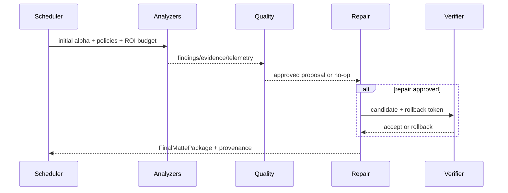

# 16 — Sequence Diagrams

Cancellation is cooperative: analyzers return partial read-only results; repair never commits without verification. Verification reruns only analyzers affected by the proposed operator and allows one ROI-local retry.
