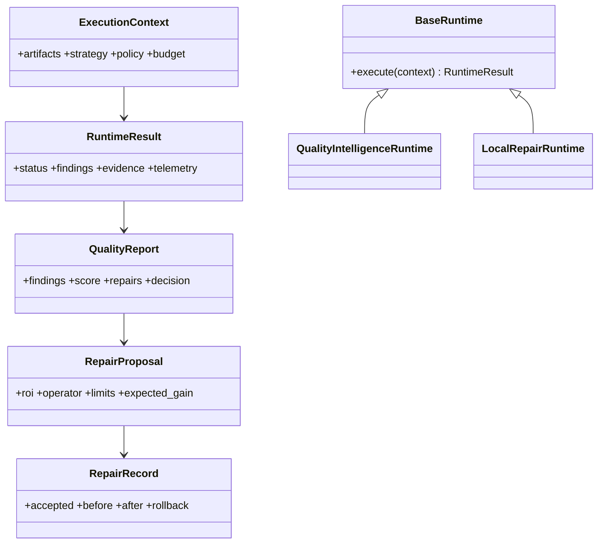

# 17 — Class Diagrams

Context owns job-lifetime artifact references; application owns immutable source lifetime; reports are immutable after export; repair records are append-only. Runtime instances cannot retain job arrays except explicit bounded caches.
