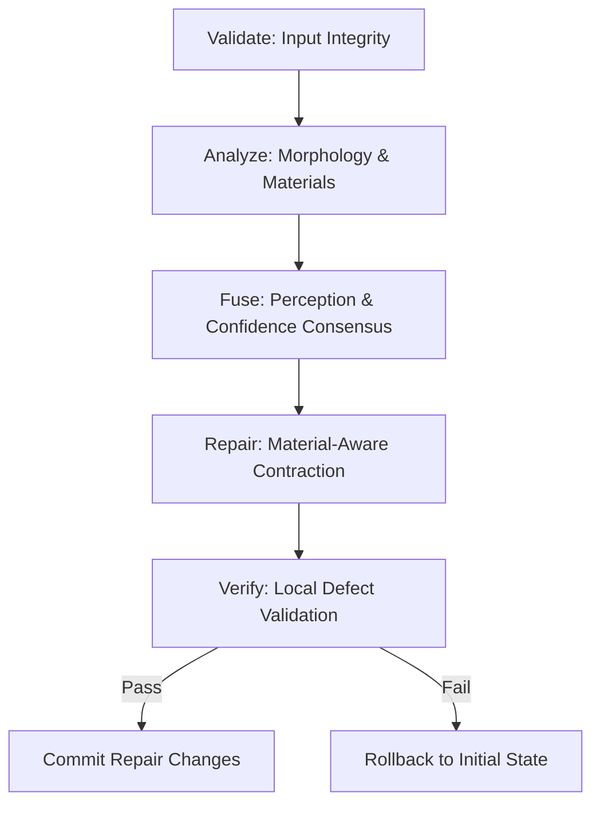

# GhostCut Offline - AI Background Remover Specification & Architecture Bible (v9.2.0)

Welcome to the **GhostCut Offline** development repository. This document serves as the absolute specification, architecture bible, and cross-agent instruction manual for the project. It provides all necessary context for developer teams, product managers, and parallel AI assistant agents (such as Antigravity, ChatGPT, Claude Code, and Cursor) to collaborate on the codebase.

---

## 1. Project Directory Structure

The project root directory is structured into three clean sub-folders to separate active development, compiled output distribution, and version control tracking:

```
H:\AI Tools\Background Removal
├── Ai Project/                  # Active working directory containing full codebase & specs
│   ├── src/                     # Source code directory
│   │   ├── core/                # Core AI processing and refinement runtimes
│   │   ├── gui/                 # PyQt6 frontend views and components
│   │   └── models/              # ONNX runtime model files (birefnet, vitmatte)
│   ├── build_scripts/           # PyInstaller spec and NSIS installer scripts
│   ├── implementation_plans/    # Iterative architecture plans and result logs (v8.7 - v9.2)
│   ├── Test images/             # Quality evaluation straight and curly hair models
│   ├── build/                   # Temporary compilation files (ignored in git)
│   ├── dist/                    # Compiled developer build output (ignored in git)
│   ├── learning_db.json         # Adaptive parameters recipe knowledge base
│   └── failure_db.json          # Failure-mode memory database
│
├── Distribution/                # Output folder for production delivery installers
│   └── GhostCut_Offline_Setup_v1.0.0.exe  # Solid-compressed offline setup executable
│
└── Github Package/              # Clean Git repository folder
    └── .gitignore               # Automated exclusions file for ONNX, DBs, and builds
```

---

## 2. Core Matting & Refinement Architecture

GhostCut uses a combination of deep learning semantic models and classical boundary mathematical refinement algorithms to perform precise background removal:

### 2.1. Inference & Matting Engines
* **Semantic Segmentation (BiRefNet)**: The base silhouette mask is estimated using a general-purpose semantic seg model (`birefnet-general.onnx`) or a lightweight variant (`birefnet-general-lite.onnx`).
* **Matting Engines**:
  * **Guided Filter Matting (GF)**: A fast (2-4s), classical local edge propagation algorithm that calculates matte boundary transparency by comparing local variance/covariance matrices of BGR channels.
  * **ViTMatte (Trimap-Guided)**: A state-of-the-art visual transformer matting model (`vitmatte-small.onnx`) that resolves intricate details (like flyaway curls, curly hair, and lace) by evaluating a generated gray trimap band.

---

## 3. GhostCut v8.5 Quality Intelligence Pipeline

To eliminate background bleed (halos) and edge artifacts (like pixelation), the quality loop processes the raw mask through a sequential **Quality Job Flow**:



### 3.1. Quality Runtimes
1. **`HairMorphologyRuntime`** (`hair_morphology_runtime.py`): Examines orientation coherence, flyaway likelihood, and density to determine the best hair matting policy.
2. **`EdgeIntelligenceRuntime`** (`edge_intelligence_runtime.py`): Maps pixel transition regions into classes like `hard`, `strand`, or `unknown`.
3. **`MaterialBoundaryRuntime`** (`material_boundary_runtime.py`): Fuses material masks (Skin, Fabric, Hair) with boundary constraints to protect flat edges from over-softening.
4. **`HaloDetectionRuntime`** (`halo_detection_runtime.py`): Compares BGR edge values to the computed background color to localize bright white halo rings or chroma spill.
5. **`QualityIntelligenceRuntime`** (`quality_intelligence_runtime.py`): Produces an immutable quality scorecard mapping edge failure grades.
6. **`LocalRepairRuntime`** (`local_repair_runtime.py`): Executes transaction-managed repairs (alpha contraction and color smoothing) on padded ROI crops.

---

## 4. Boundary Refinement & Self-Tuning Implementations (v9.2.0)

The v9.2.0 release includes critical boundary refinements and offline self-tuning features:

### 4.1. Material-Guided Adaptive Mask Contraction
To trim white outlines on hard borders without degrading hair fibers, `LocalRepairRuntime` applies a blended contraction:
* **Detail/Hair Pixels (`protection = 1.0`)**: Undergoes a gentle 1-pixel contraction to keep hair details intact.
* **Hard Edge/Skin/Clothing Pixels (`protection = 0.0`)**: Undergoes a firm 3-pixel contraction to scrape away bright boundary lines.
* No binary gating or color-distance gaps are created.

### 4.2. Spatial Boundary Color Decontamination
* **The Problem**: Pixels right at the silhouette border are forced to value `255` by the matting engine. Alpha-threshold decontamination (which was restricted to values `< 250`) would skip these pixels, leaving them bright white from the studio background.
* **The Solution**: We calculate a spatial transition zone using `cv2.distanceTransform` extending `15px` inside and `10px` outside the mask boundary. Color decontamination runs on this entire spatial neighborhood, ensuring all boundary pixels blend seamlessly with local foreground hair/sweater colors.

### 4.3. Floating Background Speckles filter
* Residual segmentation noise (small floating dust islands in the transparent background) is filtered using `cv2.connectedComponentsWithStats`.
* Any disconnected foreground cluster with an area smaller than `0.002%` of the total image area (e.g., `< 50px`) is automatically deleted (set to `0` alpha) in `process_image` before saving.

### 4.4. Interactive Export Feedback Dialog & Self-Tuning Policy Loop (v9.2.0)
* **Feedback Dialog (`FeedbackDialog`)**: Presents a glassmorphic PyQt6 rating window post-export summarizing AI-detected scene parameters (Dominant Material %, Active Model, Quality Scorecard, Vision Flags).
* **Defect Collector & Policy Engine (`user_feedback_runtime.py`)**: Accepts 1-5 star ratings, structured defect tags (`hair_flyaways_missing`, `clothing_edge_halo`, `studio_light_bleed`, `foreground_cut_off`, `background_noise_left`), and custom user notes to dynamically tune edge erosion and flyaway protection parameters.

---

## 5. GUI Layout & UX Rules

The desktop editor is built in PyQt6 with modern dark-mode styling (Consolas/Inter font hierarchy, border-radius cards, active-state badges):

### 5.1. Live Preview Guard Logic
* Adjusting parameters (Radius, Sharpness, Glass Mode) in the configuration panel only triggers a background preview update (`schedule_live_preview`) if the loaded file has already been processed by the AI (i.e. is registered in `self.processed_files`).
* If a new file is loaded, clicking "Apply" simply caches parameters locally without launching premature background tasks.

### 5.2. Unlocked Radius Slider
* The edge refinement radius slider in `toolbar.py` is configured with a range of `(1, 25)`.
* This unlocks tight `1px` or `2px` matting boundaries for professional users desiring razor-sharp borders.

---

## 6. Build and Compilation Pipelines

### 6.1. PyInstaller Binary Bundling
To compile the Python files and ONNX binaries into a standalone runtime folder `dist/GhostCutOffline`:
```powershell
& "C:\Users\Neha Tyagi\AppData\Local\Python\pythoncore-3.14-64\Scripts\pyinstaller.exe" --noconfirm --clean build_scripts/pyinstaller_win.spec
```

### 6.2. NSIS Installer Packaging
To package the compiled bundle into a single offline windows setup installer (`GhostCut_Offline_Setup_v1.0.0.exe`) using solid LZMA compression:
```powershell
# Run from within build_scripts/ directory
& "C:\Users\Neha Tyagi\AppData\Local\electron-builder\Cache\nsis\nsis-3.0.4.1\makensis.exe" installer_config.nsi
```
The output setup file is written to `build_scripts/` and must be copied to `Distribution/` for deployment.

---

## 7. Cross-Agent Collaboration Guide

If you are an AI assistant agent (ChatGPT, Claude Code, Cursor, etc.) working on this repository, please adhere to the following workflow:

1. **Working Directory**: Always execute commands, run scripts, and write code relative to the **`Ai Project`** subfolder. Avoid modifying folders outside it unless specifically asked by the user to update the `Distribution` or `Github Package` directories.
2. **Quality Loop Integrity**: When modifying `process_image` or matting engines, verify that you preserve the quality evaluation, local repair transactions, and self-critic metrics.
3. **ONNX Weights Check**: The `models/` directory inside `src/models/` contains ONNX weights. If they are missing or if you need to run tests locally, refer to the console downloader launcher script.
4. **Git Syncing**: Do not commit ONNX model weights (`*.onnx`) or database caches (`*_db.json`) directly to the Git repository inside `Github Package`. Refer to the `.gitignore` configuration in `Github Package/` for exact rules.
